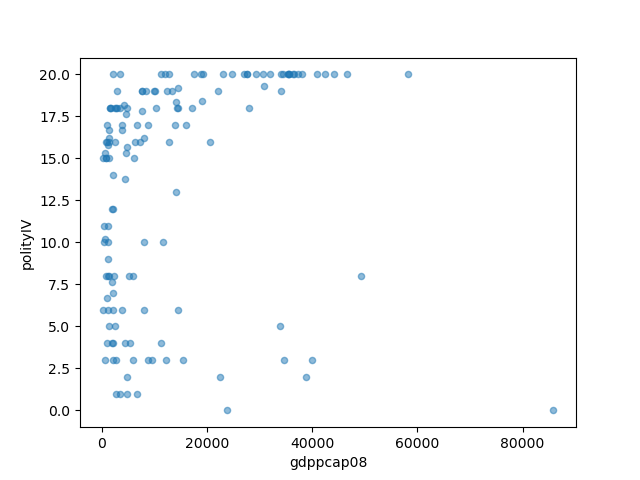
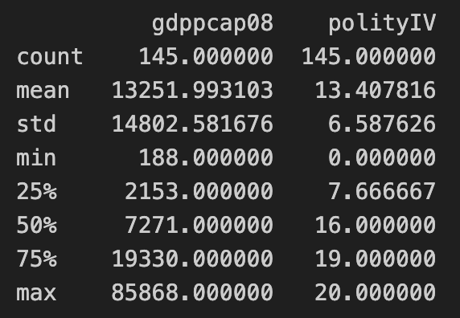

# CI using GitHub Actions of Python Data Science Project
[](https://github.com/nogibjj/CIDS_minlingz/actions/workflows/install.yml)[](https://github.com/nogibjj/CIDS_minlingz/actions/workflows/format.yml)[](https://github.com/nogibjj/CIDS_minlingz/actions/workflows/lint.yml)[](https://github.com/nogibjj/CIDS_minlingz/actions/workflows/test.yml)

Continuous Integration using GitHub Actions of Python Data Science Project

## Files

* `world-small.csv` -- Dataset to read
* `ds.py`-- Python script using Pandas for descriptive statistics
* `ds.ipynb` -- Jupiter notebook with cell performating descriptive statistics using Pandas
* `lib.py` -- Shares the common code between the python script `ds.py` and Jupiter notebook `ds.ipynb`
* `test_ds.py` -- Python script to test `ds.py`
* `test_lib.py` -- Pript script to test library `lib.py`
* `Makefile` -- Make file used by GitHub Action workflow step
* `requirements.txt` -- Dependency install requirement usd by GitHub Action workflow
* `install.yml` -- GitHub Action workflow step - install dependencies
* `format.yml` -- GitHub Action workflow step - format using black
* `lint.yml` -- GitHub Action workflow step - lint with ruff
* `test.yml` -- GitHub Action workflow step - test using pytest

## GitHub Action Workflow

```Makefile
install:
	python -m pip install --upgrade pip
	pip install ruff
	pip install black
	pip install -r requirements.txt

test:
	pytest test_lib.py
	pytest test_ds.py
	py.test --nbval ds.ipynb
	
format:	
	black .

lint:
# stop the build if there are Python syntax errors or undefined names
	ruff --format=github --select=E9,F63,F7,F82 --target-version=py37 .
# default set of ruff rules with GitHub Annotations
	ruff --format=github --target-version=py37 .
```

## Python code and Jupyter notebook

### Common code between the python script and Jupiter notebook - `lib.py`
```python
def read_csv_file(file_name):
    """Read csv file and return data"""
```
```python
def generate_statistics_summary(data):
    """Generate statistics summary"""
```

### Descriptive statistics python script using Pandas - `ds.py`
```python
def pandas_ds():
    """Read csv file,
    generate statistics summary
        and plot interested columns"""

    # Read csv file
    data = lib.read_csv_file("world-small.csv")
    ...
    # scatter plot visualization and save it as "plot.png" file
    data.plot.scatter(x="gdppcap08", y="polityIV", alpha=0.5)
    plt.savefig("plot.png")
    ...
    # return statistics summary for the function
    summary = lib.generate_statistics_summary(data[["gdppcap08", "polityIV"]])
    print(summary)
    return summary
```

### Descript statistics Jupiter notebook - `ds.ipynb`
```python
# Read csv file
data = lib.read_csv_file("world-small.csv")
...
# scatter plot visualization
data.plot.scatter(x="gdppcap08", y="polityIV", alpha=0.5)
plt.savefig("plot.png")
plt.show()
...
```


```python
# return statistics summary
summary = lib.generate_statistics_summary(data[["gdppcap08", "polityIV"]])
...
```

## Test

### Test common code - `test_lib.py`
```python
def test_read_csv_file():
    """Check if the DataFrame not empty"""

    df = read_csv_file("world-small.csv")
    assert not df.empty
```
```python
def test_generate_statistics_summary():
    """Check if the summary DataFrame has the expected mean row"""

    summary = generate_statistics_summary(read_csv_file("world-small.csv"))
    assert "mean" in summary.index
    assert "std" in summary.index
    assert "50%" in summary.index
```

### Test descriptive statistics python script - `test_ds.py`
```python
def test_pandas_ds():
    """Check if the summary DataFrame has the expected mean row"""
    summary = pandas_ds()
    assert "mean" in summary.index
    assert "std" in summary.index
    assert "50%" in summary.index
```
```python
def test_save_plot():
    """Check if "plot.png" file was created"""
    assert os.path.isfile("plot.png")
```

### Test Jupiter notebook using nbval plugin
```
py.test --nbval ds.ipynb
```

## Dependencies - `requirements.txt`
```
pytest
nbval==0.9.6
black==23.3.0
ruff==0.0.285
numpy==1.25.2
pandas==2.1
matplotlib==3.7.1
```

## Youtube video: https://youtu.be/OFwB4TR_2fQ
